# PixelPixie [](https://travis-ci.org/rumkit/PixelPixie)


- [Motivation](#motivation)
- [Usage](#usage)
  - [Generating grid](#generating-grid)
  - [Parsing font image](#parsing-font-image)
- [Configuration](#configuration)
  - [CellsLookUpDirecton](#cellslookupdirecton)
  - [PixelsLookupDirection](#pixelslookupdirection)
- [Examples](#examples)
  - [One symbol](#one-symbol)
  - [Small font](#small-font)
  - [More convoluted example](#more-convoluted-example)


# Motivation

Let's imagine you are an embedded programmer and you want to play with some kind of LCD screen. You want to print some text and that is suddenly hard, because you can only draw pixels. You can't use .ttf fonts because you have no OS in your device (and even if you have, it might have no concept of 'files' alltogether).

So you have googled something like "bitmap fonts for embedded lcd screen arduino" and whooaa that's really a lot of them! And of course none of them is acceptable. It's always like that. Maybe you need 5x7 font but all you see is either 5x8 or 6x7. Maybe you are looking for non-latin font. 
Or maybe you are dealing with something like MAX7456 for making OSD overlay and suddenly you need _two_ bits for each pixel, not one. Or maybe you need three bits for each pixel. Or four. Or maybe you need pixel order other than top down.

And here is a solution for you problem! PixelPixie is a bitmap font generator that doesn't use hardcoded bits per pixel value or hardcoded symbol size. With PixelPixie you can finally forget that exhausting hours of drawing bitmap font on a piece of paper and then transforming it in hex by hand. Instead you can use generated png with grid and use your preferred graphical editor. And that should be better, right?

# Usage

```
Pixie 1.4
USAGE:
pixie parse someimage.bmp
pixie parse input.bmp --output=array.txt -s -c myconfig.json
pixie generate -w 5 -h 10
pixie generate -w 16 -h 16 -i font.txt

You can get additional help by using 'pixie parse --help' for example

  generate    generates a graphical pattern optionally filled with font

  parse       parses  a pattern filled with graphical font to a byte array

  help        Display more information on a specific command.

  version     Display version information.
```

## Generating grid

```
pixie generate

 -w, --width        Required. grid pattern width in symbols

 -h, --height       Required. grid pattern height in symbols

 -o, --output       (Default: output.png) output file name

 -n, --enumerate    (Default: None) draw grid rows and columns numbers. Use '-n Hex' or '-n Decimal'. Resulting image should be parsed with -h option

 -i, --input        path to csv file with HEX data, that will be parsed and used to fill images with symbols

 -c, --config       (Default: config.json) configuration file path
```

`-i` can be used if you already have your font as an array and you want to transform it into nice grid image.

## Parsing font image

```
pixie parse

  -s, --single-array    place all characters to single array

  -o, --output          (Default: output.txt) output file name

  -h, --skip-headers    (Default: false) skip headers with rows and columns numbers (first row and first column are not processed)

  -c, --config          (Default: config.json) configuration file path

```

# Configuration

All configuration is done via JSON config file. Please note that comments are not allowed normally in JSON and are listed here only as reference.

```YAML
{
  "BitsPerPixel": 2,                // How many bits per pixel are used in a result array
  "SymbolWidth": 12,                // One symbol dimensions in pixels
  "SymbolHeight": 18,               //
  "DelimeterWidth": 1,              // Symbol delimeter width and height
  "DelimeterHeight": 1,             //
  "DelimeterColor": "#FF0000",      // Color of delimeter in generated pattern

  "CellsLookupDirection": "RowWise", 
  "PixelsLookupDirection": "ColumnWiseYReverse",

  "ColorMapping": {                 // A dictionary that is used to map a color in bitmap to
    "#FFFFFF": 0,                   // a bit sequence. Bit sequence is stored in DEC. And
    "#000000": 1,                   // only first N bits (BitsPerPixel) are taken in account
    "#969696": 2
  }
}
```

``` DelimeterColor  ``` parameter only applies to empty grid generation, as well as ``` ColorMappings ``` are used only while parsing graphical font. Default config.json  can be found [here](https://github.com/rumkit/PixelPixie/blob/master/Pixie/config.json).

## CellsLookUpDirecton

Each cell of the grid pattern contains one symbol or a part of a symbol. `CellsLookupDirection` controls the order of lookup of symbols in the bitmap image file. It can be:

`CellsLookupDirection` and `PixelsLookupDirection` can be (each number represents one cell of the grid; 2 by 2 grid for simplicity):
 - "RowWise"

    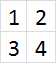

 - "RowWiseYReverse"

    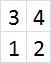

 - "ColumnWise"

    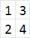

 - "ColumnWiseYReverse"

    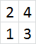


## PixelsLookupDirection

Each row or column of pixels will be transformed into byte (or several bytes) of data in the output array. `PixelsLookupDirection` parameter controls the order of pixel lookup in each grid cell; we admit that it's not very intuitive.

This parameter can be 

 - "RowWise"

    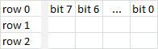

 - "RowWiseYReverse"

    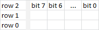

 - "ColumnWise"

    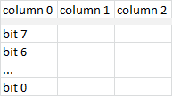

 - "ColumnWiseYReverse"

    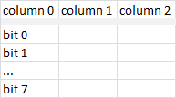

 - "UserDefined"
  
    When this parameter value is used, each grid cell is divided to blocks. Each block must contain a whole number of bytes in the generated array.  
    Order of blocks inside one cell is controlled by additional parameter - `UserDefinedBlockOrder`. This parameter should be an array.  
    For example, to describe a cell divided to four blocks, we can write:
    ``` json
      "UserDefinedBlockOrder":
      [
        [ 0, 1 ],
        [ 2, 3]
      ]
    ```

    Order of pixels in each block is controlled by another parameter - `UserDefinedPixelOrder`. This parameter should be an array as well.  
    Here's an example for 6 by 8 block:

    ``` json
    "UserDefinedPixelOrder":
    [      
      [ 7, 15, 23, 31, 39, 47 ], 
      [ 6, 14, 22, 30, 38, 46 ],
      [ 5, 13, 21, 29, 37, 45 ], 
      [ 4, 12, 20, 28, 36, 44 ], 
      [ 3, 11, 19, 27, 35, 43 ], 
      [ 2, 10, 18, 26, 34, 42 ], 
      [ 1, 9,  17, 25, 33, 41 ], 
      [ 0, 8,  16, 24, 32, 40 ]
    ]
    ```
     **Important notice**: for historical reasons, order of pixels is Y-reversed, i.e. pixel with a number 0 will be in the **top left** corner of the block, not **bottom left**.


# Examples

Complete fonts and configuration files can be found in the [examples](examples).

## One symbol

Here's our 'symbol' with maximum zoom and pixel grid enabled in the graphical editor of my choice:

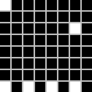

It's an 8 by 8 pixels, let's say we want one bit per pixel and each column of pixels should be transformed into one byte where black color is bit set to 0 and white color is bit set to 1. Here's our config:

``` json
{
  "BitsPerPixel": 1,
  "SymbolWidth": 8,
  "SymbolHeight": 8,
  "DelimeterWidth": 1,
  "DelimeterHeight": 1,
  "DelimeterColor": "#FF0000",
  "BackgroundColor": "#000000",
  "CellsLookupDirection": "ColumnWise",
  "PixelsLookupDirection": "ColumnWise",
  "ColorMapping": {
    "#FFFFFF": 1,
    "#000000": 0
  }
}
```

Obviously `CellsLookupDirection` doesn't matter since our grid contains only one cell.
Pixie gives us this array:

``` cpp
unsigned char c1[8] = 
{
    0x81, 0x00, 0x01, 0x00, 0x01, 0x00, 0x21, 0x00
};
```

And if we set `PixelsLookupDirection` to `RowWise`:
``` cpp
unsigned char c1[8] = 
{
    0x80, 0x00, 0x02, 0x00, 0x00, 0x00, 0x00, 0xAA
};
```

## Small font

Let's examine a typical pixel font for monochrome LCD display. It's a typical setup; every pixel is controlled by one bit and pixels are composed in vertical columns of 8, so each byte of our font will describe a column of 8 pixels.  

Here's a complete 6x8 one bit per pixel font:  

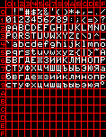

Since it's so small, let's examine it more closely:  


Here topmost row and leftmost column are not a part of the font, they are the numeration of rows and columns. It can be quite handy if you want to know the number of some symbol without counting.  
The rest of the picture describes a font; red is `DelimeterColor`, it separates symbols, black and white are colors of the font... should I really explain it, it's kinda obvious? Anyway.

Okay, here's JSON config for this font assuming we want each column of pixels to represent one byte with bit 0 being at the top:

``` json
{
  "BitsPerPixel": 1,
  "SymbolWidth": 6,
  "SymbolHeight": 8,
  "DelimeterWidth": 1,
  "DelimeterHeight": 1,
  "DelimeterColor": "#FF0000",
  "BackgroundColor": "#000000",
  "CellsLookupDirection": "RowWise",
  "PixelsLookupDirection": "ColumnWiseYReverse",
  "ColorMapping": {
    "#FFFFFF": 1,
    "#000000": 0
  }
}
```

and here's a command line to generate .h file:  
`pixie.exe parse small.png --single-array --skip-headers -c small_config.json -o small.out.h`

We need `--skip-headers` to skip leftmost column and topmost row with symbol numeration.

## More convoluted example

Let's say we use the same monochomre LCD screen but we want a more sizeable font, for example, two times bigger in each dimension. So we want 12 by 16 pixels font. But we need to somehow split each symbol into bytes. How can we do that? That depends on how our code will send those bytes to the display.   
For instance, we can split each symbol into four blocks; each block will be 6 by 8 pixels, i.e. 6 bytes.

Here's a part of the image for such a font:

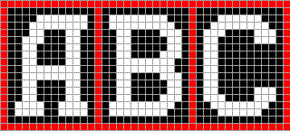

We'll need to use `PixelsLookupDirection`. With `UserDefinedPixelOrder` we'll have to describe the order of pixels in one block. **Please note that they are in Y-reversed order!**

And with `UserDefinedBlockOrder` we describe the order of blocks in one cell.

Here's config file:

``` json
{
  "BitsPerPixel": 1,
  "SymbolWidth": 12,
  "SymbolHeight": 16,
  "DelimeterWidth": 1,
  "DelimeterHeight": 1,
  "DelimeterColor": "#FF0000",
  "BackgroundColor": "#000000",
  "CellsLookupDirection": "RowWise",
  "PixelsLookupDirection": "UserDefined",
  "ColorMapping": {
    "#FFFFFF": 1,
    "#000000": 0
  },
  "UserDefinedPixelOrder":
  [      
    [ 7, 15, 23, 31, 39, 47 ], 
    [ 6, 14, 22, 30, 38, 46 ],
    [ 5, 13, 21, 29, 37, 45 ], 
    [ 4, 12, 20, 28, 36, 44 ], 
    [ 3, 11, 19, 27, 35, 43 ], 
    [ 2, 10, 18, 26, 34, 42 ], 
    [ 1, 9,  17, 25, 33, 41 ], 
    [ 0, 8,  16, 24, 32, 40 ]
  ],
  "UserDefinedBlockOrder":
  [
    [ 0, 1 ],
    [ 2, 3]
  ]
}
```
